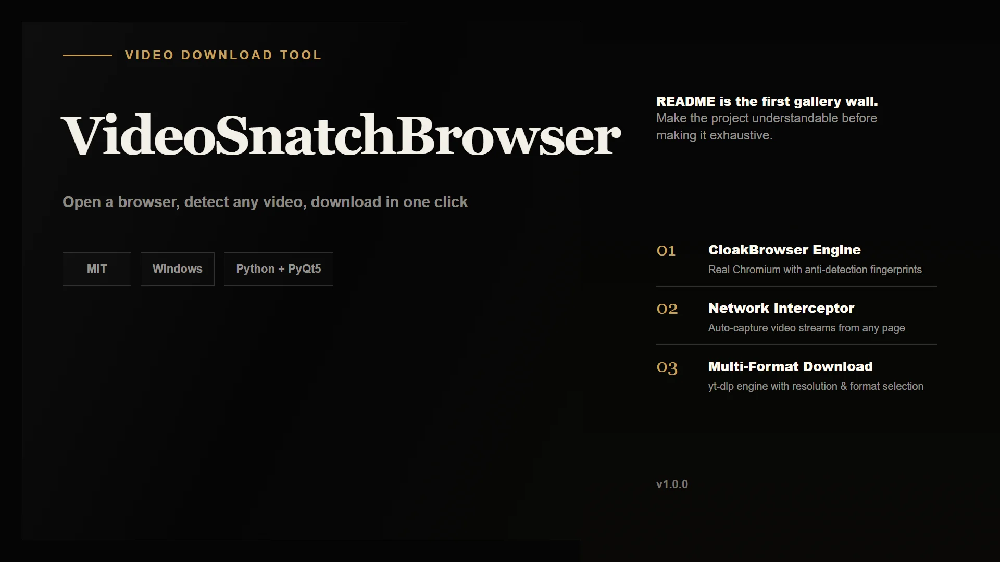
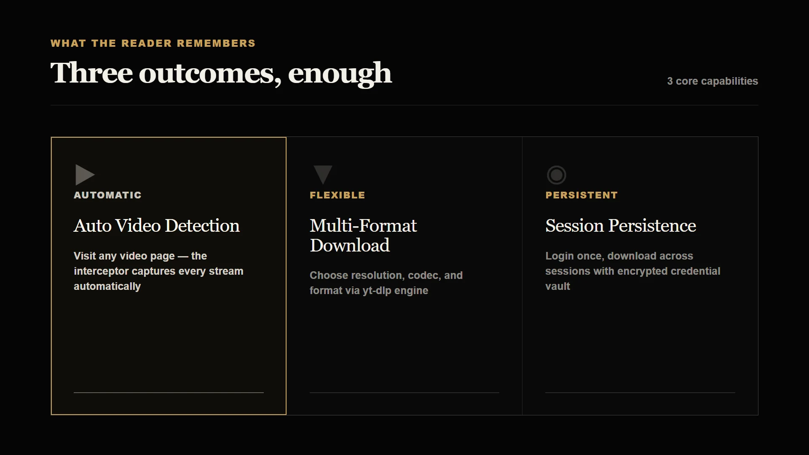

<div align="center">

# VideoSnatchBrowser

**Open a browser, detect any video, download in one click**



[](./LICENSE)

</div>

---

## 这是什么

VideoSnatchBrowser 是一个基于真实浏览器环境的视频下载工具。打开内置的 Chromium 浏览器访问任意视频页面，网络拦截器会自动捕获所有视频流，无需手动复制链接或切换工具。

## 为什么需要它

现有的视频下载工具通常需要手动粘贴 URL、不支持登录态保持、无法自动发现页面中的视频流。当你需要从多个站点批量下载、或需要保持登录状态访问受限内容时，传统工具的工作流变得繁琐且低效。

## 你会得到什么



## 工作方式

VideoSnatchBrowser 基于 CloakBrowser 启动一个完整的 Chromium 浏览器实例。网络请求拦截器实时监测页面中所有媒体请求，检测到的视频流自动呈现到下载队列。内置 yt-dlp 引擎支持几乎所有主流视频站点的格式解析，你可以自由选择分辨率、编码和输出路径。认证信息和会话状态加密存储，重启后无需重新登录。

## 快速开始

```bash
# 克隆仓库
git clone https://github.com/lmhopen/VideoSnatchBrowser.git
cd VideoSnatchBrowser

# 安装依赖
pip install -r requirements.txt

# 启动（首次运行自动下载 CloakBrowser）
python main.py
```

或双击 `启动视频下载浏览器.bat`。

## 安装

### 系统要求

- Python 3.8+
- Windows 7+（推荐 Windows 10/11）

### 依赖

| 包 | 用途 |
|---|---|
| cloakbrowser | 真实 Chromium 浏览器引擎 |
| playwright | 浏览器自动化控制 |
| PyQt5 | 桌面图形界面 |
| yt-dlp | 视频下载引擎 |
| httpx | HTTP 网络请求 |
| cryptography | 认证信息加密存储 |

依赖由 `requirements.txt` 统一管理，`pip install -r requirements.txt` 即可完成安装。

## 许可证

[MIT](./LICENSE)

## 关于作者

[lmhopen](https://github.com/lmhopen)
